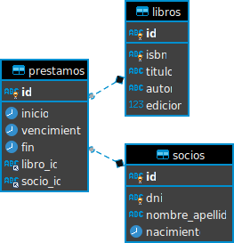

# Trabajo final de PWD 2020

Este trabajo consiste en desarrollar una aplicación web desde cero en la que se puedan realizar las cuatro operaciones **HTTP** que vimos durante la cursada: **GET**, **PUSH**, **PUT**, **DELETE**. A continuación se describirá el contexto del problema a resolver.

> **¡ATENCIÓN!** Para configurar el entorno y saber los comandos útiles, acceder al archivo [**AYUDA.md**](AYUDA.md).

## Condiciones de aprobación del trabajo final

A continuación se listarán los aspectos que se tendrán en cuenta para evaluar el trabajo:

- Que se haga un uso constante del repositorio Git. Esto significa que cada día que programen una parte del trabajo, por más que quede inconcluso, se recomienda que hagan un commit y lo suban a GitHub. Se valorará aquellos trabajos que tengan un historial de commits rico que muestre la evolución del desarrollo del trabajo.
- Que todos los tests (DAOs y Modelos) pasen.
- Que todas las operaciones funcionen: listar, crear, editar y borrar todas las entidades.
- La escritura del código: cuanto más legible, más se valorará.
- El diseño de las vistas. En este caso, están libres de usar el framework de UI que quieran (si es que quieren usar uno). Ya sea bootstrap, bulma, material-ui, o el que más gusten.

Además del desarrollo del trabajo, habrá una instancia de defensa del mismo en la mesa del final. Allí se revisará que todo funcione y se harán preguntas relacionadas a la implementación del trabajo.

La nota estará condicionada en gran medida por el desarrollo del trabajo, pero también se verá afectada por la defensa (tanto como para subir la nota, como para bajarla).

## Problema

Una biblioteca pidió el desarrollo de una aplicación web para el manejo de los préstamos de libros. Se necesita que se puedan almacenar sus socios, los libros y los préstamos que hace cada socio. A continuación se muestra el diagrama de Entidad Relación de los datos que necesita la biblioteca para cada entidad.



## Solución

Es necesario construir un sistema cliente-servidor de 3 capas, con MariaDB como base de datos, PHP como lenguaje de servidor y HTML/CSS/JS en el cliente. Para ello se implementará con una estructura MVC (Modelo/Vista/Controlador), con el objetivo de separar las responsabilidades de cada clase. A continuación se describirán las responsabilidades de cada capa de la arquitectura MVC que se debe implementar:

### Modelo

En esta capa se definen las clases que representan la lógica de negocios de nuestra aplicación, es decir, las funcionalidades internas del sistema. Estas clases deben ser las únicas en implementar la lógica de la aplicación.

Si es necesario realizar validaciones, estas clases son las indicadas para contener esa lógica.

#### Libro

- Todos los atributos son obligatorios.
- El atributo **ISBN** es único, por lo que no pueden haber dos libros con el mismo isbn. (Esto se valida en la BD).

#### Socio

- Todos los atributos son obligatorios.
- El atributo **DNI** es único, por lo que no pueden haber dos socios con el mismo dni. (Esto se valida en la BD).
- El atributo **nacimiento** debe ser una instancia de la clase `LocalDate`.
- El parámetro **nacimiento** que se recibe al construir una instancia debe ser un string que cumpla con el formato estándar `YYYY-MM-DD`. Este string debe procesarse antes de asignarlo al atributo **nacimiento** de la instancia. Para eso debe hacerse lo siguiente:
  ```php
  $this->nacimiento = LocalDate::parse($nacimiento);
  ```
  Este método estático crea una instancia de la clase `LocalDate` con la fecha descrita en el string `$nacimiento`.
- El atributo **nacimiento** debe ser serializado como un string, para eso se debe castear el atributo a `string`:
  ```php
  [
    // otros atributos
    'nacimiento' => (string) $this->nacimiento,
  ];
  ```

#### Préstamo

- Los atributos **inicio**, **libro** y **socio** son obligatorios durante la creación.
- Los parámetros **vencimiento** y **fin** deben recibirse en **null** durante la creación.
- Las tres fechas deben cumplir el siguiente formato: `YYY-MM-DDTHH:MM:SS` donde la `T` entre los días y la hora, justamente separa eso (estándar de fechas).
- La fecha **fin** es el **único** atributo de un préstamos que puede editarse.
- No se puede crear un préstamo de un libro que actualmente está prestado.
- Se pueden prestar hasta **dos** libros a un mismo socio.
- La fecha de **inicio** debe ser una instancia de `LocalDateTime`. Para eso se debe hacer lo siguiente:
  ```php
  $this->inicio = LocalDateTime::parse($inicio);
  ```
  Este método estático crea una instancia de la clase `LocalDateTime` con la fecha descrita en el string `$inicio`.
- Si el parámetro **id** no existe, es la creación de un nuevo préstamo, entonces se debe:
  - Validar que **vencimiento** y **fin** sean **null**.
  - Crear una instancia de `LocalDateTime` equivalente a 7 días después a la fecha **inicio**. Para eso se debe hacer lo siguiente:
    ```php
    $this->vencimiento = $this->inicio->plusDays(7);
    ```
- Si el parámetro **id** sí existe, significa que el préstamo estaba en la DB, entonces se debe:
  - Asignar el valor de la fecha de **vencimiento** que SÍ se recibe en los parámetros del método constructor:
  ```php
  $this->vencimiento = LocalDateTime::parse($vencimiento);
  ```
  - Asignar el valor de la fecha **fin** en caso que no sea **null**:
  ```php
  $this->fin = LocalDateTime::parse($fin);
  ```

### Pseudo capa DAOs

Los DAO (Data Access Object o Objetos de Acceso a Datos) son clases "debajo" de la capa de Modelos, y actúan como intérpretes entre el diseño Orientado a Objetos, con la estructura de tablas de la base de datos.

Estas clases deben implementar las consultas SQL de cada operación a la base de datos. Estas clases están contenidas en la carpeta Bd. El archivo `DaoInterface` describe qué métodos debe implementar un DAO. Deben haber tantas clases DAO como modelos hay en el sistema.

Los DAO se encargan de persistir los modelos durante la creación, edición y eliminación; así como también de recuperar la información de todas las entidades de un modelo (listado), o de uno en particular.

> Tener en cuenta que el único método de un Dao que es responsable de en instanciar modelos es el método listar, que debe devolver un arreglo de instancias de un modelo en particular. Por ejemplo, una colección de libros.

### Controlador

Los controladores definen cuáles son las operaciones que el sistema puede hacer. Estas clases tienen diversas responsabilidades, pero en resumidas cuentas podría decirse que son coordinadores: saben qué clases deben instanciar y ejecutar con el objetivo de completar una operación.

Actuán de intermediario entre la información que se recibe de internet, y lo que se debe ejecutar en el sistema para poder completar con éxito cada operación.

A continuación se listan las responsabilidades de este tipo de clases:

- Comunicarse con los DAO para poder consumir o guardar la información.
- Validar los datos que se reciben de internet.
- Devolver los datos serializados, para que así se puedan transformar a JSON y entregar al cliente.

Aunque es común que haya un controlador por un modelo del sistema, no necesariamente debe ser así. Los controladores agrupan operaciones comunes que se pueden hacer en el sistema y es muy probable que esas operaciones sea necesario invocar varias instancias de distintos modelos.

### Vistas

Representan el código del cliente. Los archivos PHP actúan únicamente como plantillas, mientras que el resto debe estar compuesto por archivos HTML, CSS y JS.

En esta capa, deben implementar las vistas utilizando lo que aprendimos sobre desarrollo orientado a componentes.

Los requerimientos de las vistas son las siguientes:

#### General para todas las vistas

Todos los datos que necesitan mostrar deben ser consumidos desde el cliente. Con PHP podríamos hidratar la vista con datos, pero no es la idea del final. Las vistas deben consumir todo por ellas mismas.

Para poder hacer eso deberán utilizar la función **fetch** nativa de los exploradores y apuntar a la URI de tipo `/api` que necesiten.

> Nota: pueden ejecutar el archivo `listar-rutas` para qué rutas hay disponibles en el servidor.

#### JavaScript global

Llegado el caso que quisieran compartir el uso de una función entre múltiples vistas, deberán crear un archivo JS dentro de la carpeta `public/componentes` y referenciarlo como se hace a continuación en cada HTML que quieran usarlo:

```html
<script src="/componentes/elNuevoArchivo.js"></script>
```

Recuerden que el cliente solo conoce los archivos que hay dentro de la carpeta `public`. El resto de los archivos no sabe que existe y tampoco tiene la posibilidad de acceder a ellos. El hecho de que las vistas (el HTML) estén dentro de la carpeta `src/Vistas` es por seguridad y para mantener el desarrollo MVC.

El archivo `public/index.php` es el encargado de obtener la vista adecuada y entregarla al cliente. Cada futuro recurso que pida el cliente, debe hacerse teniendo en cuenta esta restriccion.

#### Principal

- [ ] La ruta principal debe dar la bienvenida al usuario y mostrar los listados que puede acceder como también los links a las vistas de creación.
- [ ] Cambiar el título de la página principal. Para ello deben acceder al archivo `src/Rutas/GlobalRutas.php` y editar el atributo **titulo** del arreglo asociativo que se encuentra en ese archivo.

#### Listados

- [ ] Deberá ofrecer algún tipo de menú para navegar al resto de los listados, a la página principal y a los recursos de creación.
- [ ] Consumir los datos del listado a través de la función **fetch**, al endpoint adecuado y con el verbo HTTP en **GET**.
- [ ] Mostrar una tabla con los datos de la entidad que representa.

  Se recomienda utilizar la función JS `insertarFilas` (que se habilita importando el archivo `/componentes/procesarFilas.js`) para que automáticamente llene la tabla y agregue los botones de editar y eliminar.

  De todas maneras, valoraré la personalización de esa función para acomodarla a las necesidades de la Interfaz de Usuario (UI) cada uno.

#### Creaciones

- [ ] Utilizar los inputs adecuados para cada campo. Tener en cuenta las validaciones mínimas. Por ejemplo, si el campo es un número, que el tipo de input sea numérico.
- [ ] Obtener los datos de la (o las) entidades (solo para préstamos, que se deberán seleccionar el libro y el socio a realizar el préstamo) a través de la función **fetch**, al endpoint adecuado y con el verbo HTTP en **GET**.
- [ ] Enviar los datos en formato JSON a través de la función **fetch**, al endpoint adecuado y con el verbo HTTP en **POST**.

#### Ediciones

La vista entre la creación y la edición es muy similar. Lo único que cambiaría es que se mostraría el ID como dato informativo (¡no se pueden editar los ids!). Al mismo tiempo, si hay campos que no pueden ser editados (como la fecha de vencimiento de un préstamo), sería de la misma manera: como dato informativo.

- [ ] Obtener los datos de la (o las) entidades a través de la función **fetch**, al endpoint adecuado y con el verbo HTTP en **GET**.
- [ ] Enviar los datos en formato JSON a través de la función **fetch**, al endpoint adecuado y con el verbo HTTP en **PUT**.

### Rutas

> Nota repetida: pueden ejecutar el archivo `listar-rutas` para qué rutas hay disponibles en el servidor.

Para que toda la aplicación funcione, existe el archivo `index.php` dentro de la carpeta `public`. Esta carpeta contiene todos los recursos que pueden accederse desde internet. Así se puede mantener todo el resto de la aplicación protegida.

Este archivo `index.php` es el encargado de levantar el servidor y configurar las rutas para cada recurso.

Las rutas se encuentran en la carpeta `src/Rutas` y ya están definidas. Éstas se encargan de invocar los métodos adecuados de los controladores y procesar la respuesta que tienen que enviar al cliente.
